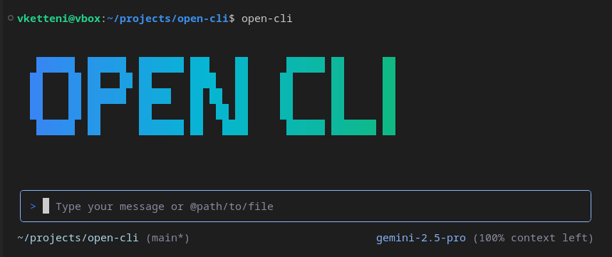

<div align="center">

# 🌐 Open CLI

**The Open Source Agentic CLI Platform**

*Reusable UI for agentic CLI tools • Service interfaces • Open core development*

[](https://www.typescriptlang.org/)
[](https://reactjs.org/)
[](https://opensource.org/licenses/Apache-2.0)
[](https://github.com/vketteni/open-cli/graphs/contributors)



### 🌟 [**Current State**](#-current-state) • 📁 [**Architecture**](#-project-architecture) • ⚡ [**Quick Start**](#-quick-start) • 🔌 [**Get Involved**](#-get-involved) 

</div>

---

## 🔥 **The Challenge**

Building agentic CLI tools requires solving the same problems repeatedly:

- 🔄 **Reimplementing common patterns** (auth, streaming, tool execution, UI components)
- 🧩 **Integrating multiple services** (chat, tools, workspace, memory management)
- 🎨 **Building polished terminal interfaces** from scratch
- 🔗 **Managing complex state** across different agentic providers
- 🛠️ **Creating consistent user experiences** while supporting diverse backends

**Every new agentic CLI starts from zero, rebuilding proven patterns.**

## ✨ **The Open CLI Approach**

Open CLI provides **reusable infrastructure** for building agentic CLI tools.

> 🎯 **Solve the hard problems once. Build on proven foundations.**

The project has three main components that work together:

- 🏗️ **Provider-agnostic core** - Complete CLI engine that works with any AI service (Google, OpenAI, Claude, local models)
- 🔌 **Clean service interfaces** - Well-defined contracts for chat, tools, auth, memory, and workspace operations
- 🎨 **Production-ready frontend** - React + Ink interface extracted from Google's Gemini CLI

```
🖥️ Rich CLI Frontend ↔ 🔌 Service Interface ↔ 🏗️ Provider-Agnostic Core ↔ 🤖 Any AI Provider
```

This means you can focus on your specific use case while building on a foundation that handles the complex CLI patterns.

---

## ⚡ **Quick Start**

```bash
git clone https://github.com/vketteni/open-cli.git
cd open-cli
npm install && npm run build && npm run dev
```

---

## 🌟 **Current State**

### 🎯 **What's Working Today**

| Component | Status | Description | 
|-----------|---------|-------------|
| **CLIProvider Interface** | ✅ Stable | Complete service interface with 6 core areas |
| **AIProvider Interface** | ✅ Stable | Standardized content generation, streaming, and token counting |
| **AuthProvider Interface** | ✅ Stable | Authentication abstraction for API keys, OAuth, service accounts |
| **Open CLI Frontend** | ✅ Production | React + Ink interface with themes, commands, UI components |
| **Open Core Backend** | ✅ Complete | Full CLI engine supporting Google, OpenAI, Claude, and local models |

### 📁 **Project Architecture**

```
open-cli/
├── packages/
│   ├── open-core/         # 🏗️ Provider-agnostic CLI engine and interfaces
│   ├── interface/         # 🔌 Service contracts and TypeScript definitions  
│   ├── open-cli/         # 🎨 CLI frontend with React + Ink components
│   └── gemini-adapter/   # 🔗 Reference integration for Google's API
├── apps/
│   └── open-cli/         # 🚀 Binary application and build configuration
├── docs/                 # 📖 Integration guides and API documentation
└── scripts/              # ⚙️  Development and build automation
```

### 🎯 **Core Components**

- **`@open-cli/open-core`**: Provider-agnostic CLI engine with complete tool execution, authentication, and provider management
- **`@open-cli/interface`**: Service contracts that define how different AI providers integrate with the core
- **`@open-cli/open-cli`**: React + Ink frontend providing rich terminal interface, themes, and commands  
- **`@open-cli/gemini-adapter`**: Reference implementation showing how to wrap existing provider APIs
- **`open-cli` binary**: Complete CLI application ready for distribution
---

### 🚧 **Integration Opportunities**

These are areas where contributors could make immediate impact:

- 🏠 **Local Model Integration** - Ollama, LLaMA, etc. for offline usage
- 🧠 **Claude Integration** - Anthropic's API integration using existing interfaces
- 🔧 **Custom CLI Tools** - Build domain-specific tools using Open Core as foundation  
- 🎨 **Frontend Enhancements** - New commands, themes, and UI components

**Interested in building an integration?** [Start a discussion!](https://github.com/vketteni/open-cli/discussions)


---

## 🚀 **Get Involved**

### 🎯 **Why Contribute**

Open CLI addresses real technical challenges that every agentic CLI builder faces:

- **Reduce duplication** - Stop rebuilding the same patterns repeatedly
- **Accelerate development** - Build on proven, tested foundations  
- **Share knowledge** - Learn from and improve established patterns
- **Shape infrastructure** - Help define how agentic CLI tools should work

### 🤝 **How You Can Contribute**

| 🏗️ **Interface Architects** | 🎨 **Frontend Engineers** | 🔌 **Provider Builders** |
|---|---|---|
| Enhance existing interfaces, add new service capabilities, improve TypeScript definitions and validation | Extend the React + Ink interface, add CLI themes, create new UI components and commands | Build new AI providers (Claude, local models), create provider-specific optimizations |

| 🧪 **Application Builders** | 📚 **Documentation Writers** | 🛠️ **DevTools Contributors** |
|---|---|---|
| Create domain-specific CLI tools using Open Core, build specialized agentic applications | Create integration guides, API documentation, and contributor onboarding materials | Add IDE integrations, debugging tools, or development utilities |

### 🎉 **Recognition**

Every contributor gets:
- 🏆 **Recognition** in our README and release notes
- 🎯 **Direct impact** on the project's direction and capabilities
- 🌟 **Showcase** for your contributions in the project
- 🤝 **Collaboration** with other contributors and maintainers

---

### 🚀 **Good First Contributions**

<details>
<summary><b>🏗️ Interface/Architecture</b> - Enhance existing interfaces</summary>

- **📝 Add method documentation** to existing service interfaces
- **🛡️ Improve TypeScript types** and error handling  
- **✅ Add validation helpers** for provider configurations
- **🧪 Create additional mock providers** for testing

</details>

<details>
<summary><b>🔌 Provider Building</b> - Add new AI services</summary>

- **🏠 Create a local model provider** for Ollama or LLaMA (great learning project)
- **🧠 Build Claude provider implementation** using existing AIProvider interface
- **🔐 Add new authentication methods** to the AuthProvider system

</details>

<details>
<summary><b>🧪 Application Building</b> - Create new CLI tools</summary>

- **📝 Build a writing assistant CLI** using Open Core foundation
- **🔧 Create a code analysis tool** with AI-powered insights  
- **📊 Develop a data analysis CLI** with natural language queries
- **🎯 Build domain-specific tools** for your particular use case

</details>

<details>
<summary><b>🎨 Frontend Enhancement</b> - Improve the user experience</summary>

- **🎨 Add new CLI themes** to the existing theme system
- **📖 Improve command documentation** and help text
- **🧩 Create new UI components** for displaying different data types
- **♿ Enhance accessibility** in the terminal interface

</details>

**Need help?** Check our [contributing guide](CONTRIBUTING.md) or ask in [GitHub Discussions](https://github.com/vketteni/open-cli/discussions).

---

## 🗺️ **Development Roadmap**

### 🎯 **Phase 1: Foundation** (Complete)
- ✅ Provider-agnostic core with multi-AI support
- ✅ Complete interface system (`CLIProvider`, `AIProvider`, `AuthProvider`)
- ✅ Production-ready CLI frontend with React + Ink
- ✅ Google and OpenAI provider implementations

### 🚀 **Phase 2: Ecosystem Growth** (Current)
- 🎯 Claude and local model providers (Ollama, LLaMA)
- 🎯 Domain-specific CLI tools built on Open Core
- 🎯 Plugin system for CLI commands
- 🎯 IDE integrations (VS Code, JetBrains)

### 🌟 **Phase 3: Innovation** (Long-term goals)
- 🎯 Multi-provider routing and load balancing
- 🎯 Advanced tool integrations
- 🎯 Enterprise features and governance
- 🎯 Community-driven feature development

**Have ideas?** [Share them in our roadmap discussions!](https://github.com/vketteni/open-cli/discussions/categories/roadmap)

---

## 🤝 **Contributing**

Welcome contributions of all kinds! Whether you're:

- 🐛 **Reporting bugs** or requesting features
- 💻 **Writing code** for new adapters or CLI enhancements  
- 📖 **Improving documentation** and guides
- 🎨 **Designing** better user experiences
- 🗣️ **Spreading the word** about Open CLI

**Every contribution matters!**

### 📋 **Getting Started**

1. 📖 Read our [Contributing Guide](CONTRIBUTING.md)
2. 👀 Check our [Code of Conduct](CODE_OF_CONDUCT.md)
3. 🍴 Fork the repository
4. 💬 Join our [GitHub Discussions](https://github.com/vketteni/open-cli/discussions)

### 🏆 **Current Contributors**

Thanks to these amazing people who are helping build better agentic CLI experiences:

<!-- Contributors will be auto-generated -->

---

## 📄 **License**

Open CLI is released under the [Apache 2.0 License](LICENSE) - the same license as the original Gemini CLI. I believe in **open, permissive licensing** that encourages innovation and adoption while providing patent protection for contributors and users.

---

<div align="center">

## 🚀 **Ready to Contribute?**

### Help us build better agentic CLI infrastructure

[](https://github.com/vketteni/open-cli/discussions)
[](docs/adapters/creating-adapters.md)
[](https://github.com/vketteni/open-cli)

**Join us in building better foundational tools for agentic CLI development.**

</div>
